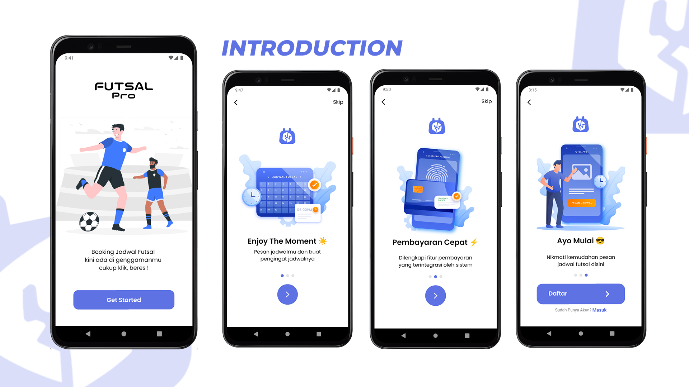
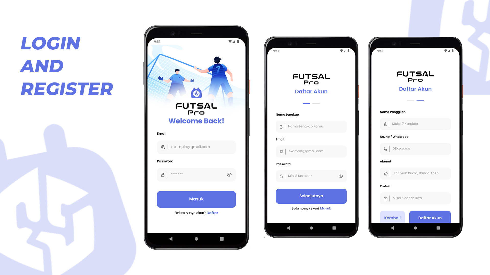
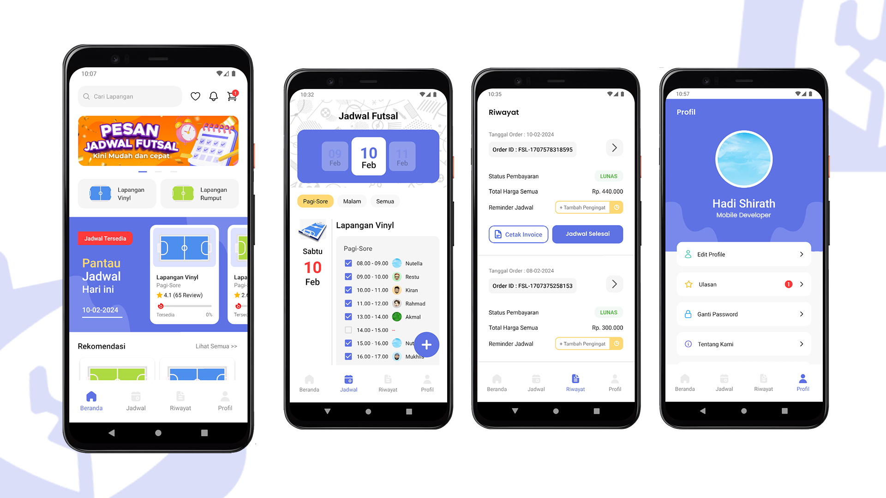
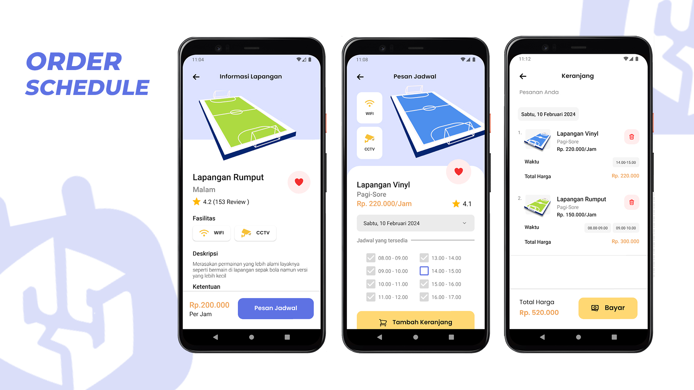
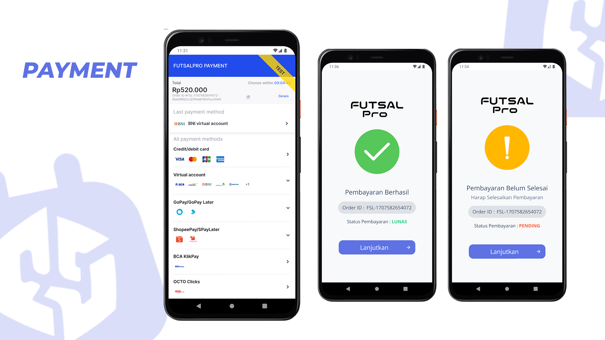
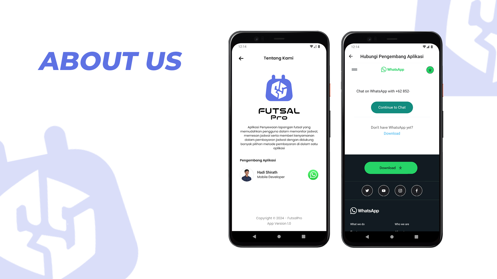

# FUTSALPRO - MOBILE

Build projects using React Native Framework

PREVIEW

Tools

1. Database Firebase
2. User Authentication
3. Payment Gateway Midtrans API
4. State Management Redux

Featured :

1. Schedule Field Booking
2. Reservation Cart
3. Checkout
4. Paying integration with Payment Gateway
5. View Order Information
6. Cancel Order
7. Payment Status
8. View Availability of All Schedules by Day
9. View Order History
10. Provide Review
11. Add Favorite
12. Add Reminder Schedule with Push Notification
13. Search Field with Search Bar
14. View Notification List
15. About Us Page
16. View User Profile and Edit Profile
